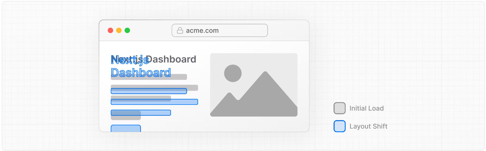
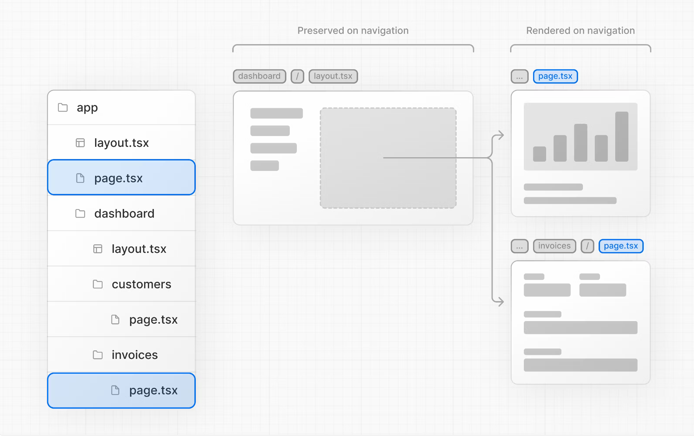

# NextJS 학습

- [공식 홈페이지 강의](https://nextjs.org/learn/dashboard-app/optimizing-fonts-images) 를 참고하면서 진행합니다.

# font 및 이미지 최적화

- 어떻게 커스텀 `next/font` 를 추가하는가
- 어떻게 `next/image` 를 추가하는가
- 어떻게 폰트와 이미지를 최적화하는가

---

## 글꼴 최적화가 필요한 이유

브라우저는 처음에 시스템 글꼴로 텍스트를 렌더링한 다음, 사용자 지정 글꼴로 교체한다. 이때 텍스트 크기, 간격, 레이아웃이 변경되고 주위의 요소가 변경될 수 있습니다.



Next.js 는 `next/image` 모듈을 사용할 때 글꼴을 자동으로 최적화합니다. 빌드할 때 폰트 파일을 다운로드하고, 정적 데이터와 함께 호스팅합니다.

즉, 성능에 영향을 미칠 수 있는 글꼴에 대한 추가 네트워크 요청이 없습니다.

---

## 이미지 최적화

`/public` 를 통해 정적 데이터를 제공할 수 있습니다. 보통은 다음과 같이 이미지를 추가합니다.

```html

```

하지만 이렇게 하게되면 몇가지 설정이 필요해집니다.

- 이미지가 다양한 크기의 화면에 반응
- 다양한 장치에서 이미지 크기 지정
- 이미지 로드 시 레이아웃 변화
- 사용자 뷰포트 외부에 있는 이미지를 지연 로드

이때 `next/image` 를 활용하면 이미지를 자동으로 최적화할 수 있다. `<Image>` 컴포넌트는 이미지 최적화를 해준다.

- 이미지가 로딩될 때, 자동으로 레이아웃이 바뀌는 것을 방지한다.
- 작은 뷰포트에서 큰 이미지를 띄울 때, 이미지 크기를 조정한다.
- 기본적으로 지연 로딩을 한다.
- 브라우저에서 지원하면 최신 포맷을 제공한다.

---

# Layouts 과 Pages 구성하기

- file-system 라우팅을 사용하기
- 라우트 세그먼트를 생성할 때, 디렉토리와 파일 역할 이해하기
- 여러 페이지 간의 공유할 수 있는 중첩된 레이아웃 만들기.
- colocation 과 partial rendering 그리고 root layout 이해하기

## Nested routing

Next.js 에서는 각 폴더가 URL 을 위한 route 를 의미합니다. 각 route 의 UI 는 `layout.tsx` 와 `page.tsx` 파일들을 이용하여 만들 수 있다.

### page.tsx

`page.tsx` 파일은 React 컴포넌트를 추출하는 Next.js 의 특별한 파일이며, route 로 접근하기 위해 필수다.

### layout.tsx

`layout.tsx` 파일을 사용하면 여러 페이지가 서로 공유하는 UI 를 만들 수 있다.

### partial rendering

Next.js 의 장점 중 하나는 `layout` 은 재랜더링되지 않으면서 `page` 컴포넌트만 업데이트 한다는 것이다.



### Root layout

`Root layout` 은 필수다. 이 레이아웃에 추가한 UI 는 모든 `page` 에 공유된다. `<html>` 과 `<body>` 태그를 수정하여 root layout 을 사용할 수 있고, metadata 도 추가할 수 있다.