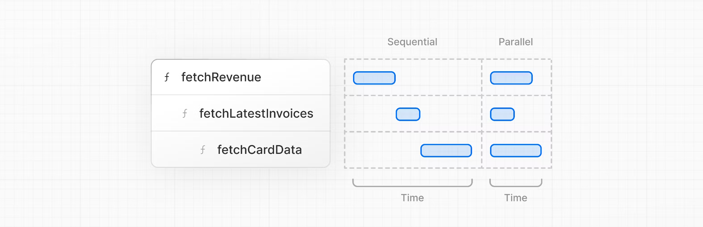

# NextJS 학습

- [공식 홈페이지 강의](https://nextjs.org/learn/dashboard-app/setting-up-your-database) 를 참고하면서 진행합니다.

# 데이터베이스 생성

- Vercel 생성 및 GitHub 레포지토리 연결하기
- PostgreSQL 만들고 연결하기
- 초기 데이터로 데이터베이스 생성하기

---

## Vercel account 생성

- [vercel.com/signup](vercel.com/signup)

## PostgreSQL 사용

위 공식 홈페이지 링크를 보면 아주 수월하게 사용할 수 있습니다.

<br><br>

# 데이터 가져오기

- APIs, ORMs, SQL 등 data 를 fetch 하는 여러가지 방법 학습
- 어떻게 Server 컴포넌트가 백엔드 자원에 안전하게 접근하는가
- 네트워크 waterfall 이란?
- 자바스크립트 패턴을 사용하여 어떻게 데이터를 병렬적으로 가져오는가

## 어떻게 데이터를 다룰 것인가?

### API layer

API 들은 코드와 데이터베이스의 중계 계층입니다. API 를 사용하는 3가지 경우가 있습니다.

- ✅ API 를 제공하는 써드파티 서비스를 사용할 때
- 클라이언트에서 데이터를 가져오는 경우 데이터베이스 비밀이 클라이언트에 노출되지 않도록 서버에서 실행되는 API 계층이 필요합니다.

Next.js 는 [라우트 핸들러](https://nextjs.org/docs/app/building-your-application/routing/route-handlers) 를 사용해서 API 엔드포인트를 만들 수 있다.

### Database queries

풀 스택 앱을 만들 때, 너는 데이터베이스와 상호작용하는 로직이 필요합니다. Postgres 와 같은 관계형 데이터베이스에 SQL, ORM, Prisma 를 사용할 수 있습니다.

database queries 를 사용하는 몇가지 경우가 있습니다.

- API 엔드포인트를 만들 때는 데이터베이스와 상호 작용하는 로직을 작성해야 합니다.

- ✅ React 서버 컴포넌트(서버에서 데이터 불러오기)를 사용하는 경우 API 계층을 건너뛰고 데이터베이스 비밀을 클라이언트에 노출할 위험 없이 데이터베이스를 직접 쿼리할 수 있습니다.

### ⭐️ 클라이언트에서 데이터를 가져올 때는 데이터베이스에서 직접 쿼리하면 안됩니다.

### 데이터 가져오기 위한 Server 컴포넌트 다루기

Next.js 는 기본적으로 React 서버 컴포넌트를 사용합니다. 서버 컴포넌트로 데이터를 가져오는 것은 새로운 접근이며, 몇가지 이점이 있습니다.

- 서버 컴포넌트는 promises 와 같이, 데이터를 가져오는 것과 같은 비동기 처리를 위한 간단한 솔루션을 제공합니다. 또한 `useEffect` 와 `useState` 또는 라이브러리 없이 `async/await` 을 사용할 수 있습니다.

- 서버 컴포넌트는 서버에서 실행되므로 비용이 많이 드는 데이터 가져오기 및 로직을 서버에 보관하고 결과만 클라이언트로 전송할 수 있습니다.

- 서버에서 실행되기 때문에, API 계층 없이 데이터베이스에 직접 query 를 사용할 수 있습니다.

### 왜 SQL 을 사용할까

- 관계형 데이터베이스의 기본 query 입니다.
- 관계형 데이터베이스에 대한 근본적인 이해를 돕습니다.
- Vercel Postgres SDK 는 SQL 인젝션을 방지합니다.

`import` 해야 서버 컴포넌트에서 사용할 수 있다.

```ts
import { sql } from '@vercel/postgres';
```

## 데이터 다룰 때 주의사항

기본적으로 Next.js는 성능 향상을 위해 경로를 미리 렌더링하는데, 이를 정적 렌더링이라고 합니다. 따라서 데이터가 변경되면 대시보드에 반영되지 않습니다.

이에 대한 해결책을 알아보기 전에, 데이터 가져오는 형태를 보겠습니다.

### waterfalls?

'워터폴'은 이전 요청의 완료 여부에 따라 달라지는 일련의 네트워크 요청을 의미합니다. 데이터 가져오기의 경우, 각 요청은 이전 요청이 데이터를 반환한 후에만 시작할 수 있습니다.


### Paraller?

워터폴을 방지하는 일반적인 방법은 모든 데이터 요청을 동시에 병렬로 시작하는 것입니다. 자바스크립트에서는 동시에 프로미스를 하기 위해 `Promise.all()` 과 `Promise.allSettled()` 함수를 사용할 수 있습니다.

```ts
const data = await Promise.all([
  invoiceCountPromise,
  customerCountPromise,
  invoiceStatusPromise,
]);
```

이러한 패턴으로 다음을 할 수 있습니다.

- 모든 데이터 가져오기를 동시에 실행하기 시작하면 성능이 향상될 수 있습니다.
- 모든 라이브러리 또는 프레임워크에 적용할 수 있는 네이티브 자바스크립트 패턴을 사용합니다.

### ❗️하지만 여기에는 한가지 단점이 있다. 만약 하나의 데이터 요청이 다른 것들에 비해 많이 느리면 어떻게 하는가?

<br><br>

# 정적 & 동적 렌더링

- 정적 렌더링이 무엇이고 어떻게 어플리케이션의 성능을 향상하는가?
- 동적 렌더링이 무엇이고 언제 사용하는가?
- 동적으로 만들기 위한 다른 접근
- 느린 데이터 가져오기를 시뮬레이션하여 발생하는 일 확인

## 정적 렌더링이란?

정적 렌더링을 사용하면 빌드 시간(배포할 때) 또는 재검증 중에 서버에서 데이터 가져오기 및 렌더링이 이루어집니다. 그런 다음 결과를 CDN(콘텐츠 전송 네트워크)에 배포하고 캐시할 수 있습니다.

### 정적 렌더링의 장점

- 더 빠른 웹 : 미리 렌더링된 콘텐츠를 캐싱하여 전 세계에 배포할 수 있습니다. 이를 통해 전 세계 사용자가 웹사이트의 콘텐츠에 더 빠르고 안정적으로 액세스할 수 있습니다.

- 줄어든 서버 로드 : 콘텐츠가 캐시되므로 서버는 각 사용자 요청에 대해 콘텐츠를 동적으로 생성할 필요가 없습니다.

- SEO : 미리 렌더링된 콘텐츠는 페이지가 로드될 때 이미 콘텐츠를 사용할 수 있으므로 검색 엔진 크롤러가 색인을 생성하기가 더 쉽습니다. 이는 검색 엔진 순위 향상으로 이어질 수 있습니다.

정적 렌더링은 정적 블로그 게시물이나 제품 페이지와 같이 데이터가 없거나 사용자 간에 공유되는 데이터가 없는 UI에 유용합니다. 정기적으로 업데이트되는 개인화된 데이터가 있는 대시보드에는 적합하지 않을 수 있습니다.

### 동적 렌더링의 장점

동적 렌더링을 사용하면 요청 시(사용자가 페이지를 방문할 때) 각 사용자에 대한 콘텐츠가 서버에서 렌더링됩니다. 동적 렌더링에는 몇 가지 이점이 있습니다.

- 실시간 데이터 : 동적 렌더링을 사용하면 애플리케이션에서 실시간 또는 자주 업데이트되는 데이터를 표시할 수 있습니다. 데이터가 자주 변경되는 애플리케이션에 이상적입니다.

- 사용자별 콘텐츠 : 대시보드나 사용자 프로필과 같은 개인화된 콘텐츠를 제공하고 사용자 상호 작용에 따라 데이터를 업데이트하는 것이 더 쉬워집니다.

- 요청 시간 정보 : 동적 렌더링을 사용하면 쿠키 또는 URL 검색 매개변수와 같이 요청 시점에만 알 수 있는 정보에 액세스할 수 있습니다.

### 동적 렌더링 만들기

서버 컴포넌트 또는 데이터 불러오기 함수 내에서 `unstable_noStore` 라는 Next.js API를 사용하여 정적 렌더링을 사용하지 않도록 선택할 수 있습니다. 즉, 캐시를 사용하지 않는 것입니다.

## 느린 데이터 가져오기를 시뮬레이션하여 발생하는 일

동적 렌더링을 사용하면 애플리케이션의 속도가 가장 느린 데이터 가져오기 속도만큼만 빨라집니다.