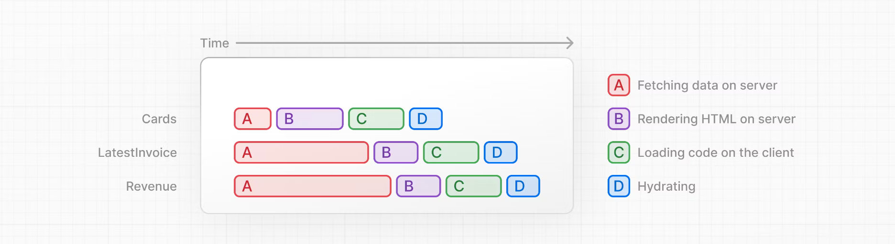
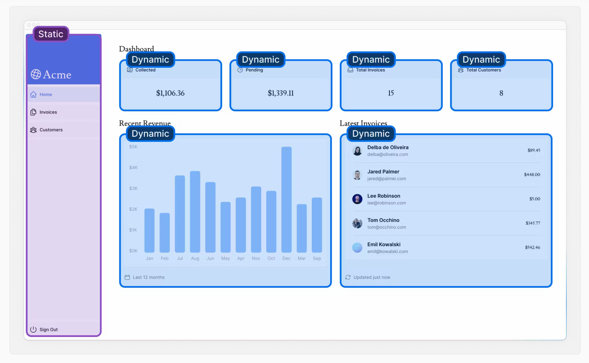
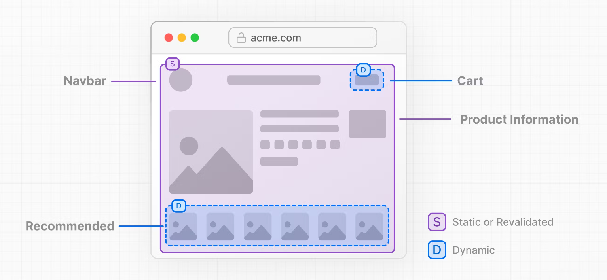

# NextJS 학습

- [공식 홈페이지 강의](https://nextjs.org/learn/dashboard-app/streaming) 를 참고하면서 진행합니다.

# streaming

- streaming이 무엇이고 언제 사용할 수 있는가?
- streaming으로 `loading.tsx` 및 Supense 와 함께 어떻게 사용하는가?
- loading skeletons 이 무엇인가?
- route 그룹이 무엇이고, 언제 사용할 수 있는가?
- 애플리케이션 어디에 Suspense boundaries 를 위치할 수 있는가?

---

## streaming 이란?

스트리밍은 경로를 더 작은 '청크'로 나누고 준비되는 대로 서버에서 클라이언트로 점진적으로 스트리밍하는 데이터 전송 기술입니다.

스트리밍을 사용하면 느린 데이터 요청으로 인해 전체 페이지가 차단되는 것을 방지할 수 있습니다. 이를 통해 사용자는 모든 데이터가 로드될 때까지 기다리지 않고도 페이지의 일부를 보고 상호 작용할 수 있으며, UI가 사용자에게 표시될 수 있습니다.



리액트 컴포넌트는 청크로 여겨지기 때문에 스트리밍에서 잘 작동한다. `Next.js` 에서 스트리밍을 사용할 수 있는 2가지 방식은 다음과 같습니다.

- page 계층에서 `loading.tsx` 파일 사용
- `<Suspense>` 사용

<br><br><br>

---

## `loading.tsx` 를 활용한 전체 페이지 스트리밍

```tsx
export default function Loading() {
  return <div>Loading...</div>;
}
```
`/app/dashboard` 에 `loading.tsx` 파일을 만들면 다음 일이 일납니다.

- `loading.tsx`는 Suspense 위에 구축된 특별한 Next.js 파일로, 페이지 콘텐츠가 로드되는 동안 대체로 표시할 폴백 UI를 만들 수 있습니다.

- `<SideNav>` 가 정적이기 때문에, 즉시 보여집니다. 동적 데이터가 로딩되는 동안 유저는 `<SideNav>` 와 상호작용할 수 있습니다.

- 사용자는 페이지 로딩이 완료될 때까지 기다렸다가 이동하지 않아도 됩니다(이를 중단 없는 탐색이라고 합니다).

<br><br><br>

---

## loading skeletons 추가

loading skeleton 은 아주 간단한 뼈대만 있는 UI 다. 정적 파일의 일부로 임베드되어 먼저 전송됩니다. 그 후 서버에서 클라이언트로 동적 콘텐츠가 스트리밍 됩니다.

<br><br><br>

---

## 컴포넌트 스트리밍

지금까지는 전체 페이지를 스트리밍하고 있습니다. 하지만 React Suspense를 사용하면 더 세분화하여 특정 컴포넌트를 스트리밍할 수 있습니다.

<br><br><br>

---

## 어디에 Suspense boundaries 를 위치할 것인가

Suspense 의 위치에 답은 없다. 여러가지 특징이 있을 뿐입니다.

- loading.tsx에서 했던 것처럼 전체 페이지를 스트리밍할 수도 있지만 구성 요소 중 하나에 데이터 가져오기가 느린 경우 로딩 시간이 길어질 수 있습니다.

- 모든 컴포넌트를 개별적으로 스트리밍할 수도 있지만, 준비되는 대로 UI가 화면에 튀어나올 수 있습니다.

- 페이지 섹션을 스트리밍하여 시차를 두는 효과를 만들 수도 있습니다. 하지만 래퍼 컴포넌트를 만들어야 합니다.


---

# Partail Prerendering (Optional)

부분 미리 렌더링은 Next.js 14에 도입된 실험적 기능입니다. 이 페이지의 내용은 기능의 안정화가 진행됨에 따라 업데이트될 수 있습니다. 실험적 기능을 사용하지 않으려면 이 장을 건너뛸 수 있습니다. 이 장은 과정을 완료하는 데 필요하지 않습니다.

- Partial Prerendering 이란?
- 어떻게 Partial Prerendering 이 작동하는가?

<br><br><br>

---

## 정적 & 동적 렌더링 결합

보통 페이지가 모두 정적이거나 동적인 경우는 드뭅니다. 대시보드를 참고하면 다음처럼 나뉩니다.

- `<SideNav>` 컴포넌트는 데이터에 의존하지 않고 사용자에게 맞춤화되지 않으므로 정적일 수 있습니다.
- `<Page>` 의 구성 요소는 자주 변경되는 데이터에 의존하고 사용자에게 맞춤화되므로 동적일 수 있습니다.



<br><br><br>

---

## Partial Prerendering 이란?

Next.js 14에는 일부 부분을 동적으로 유지하면서 정적 로딩 Shell 로 렌더링할 수 있는 실험적 기능인 부분 렌더링의 미리보기가 포함되어 있습니다. 즉, 경로의 동적 부분을 분리할 수 있습니다. 예를 들어




- 정적 경로 Shell 이 제공되어 빠른 초기 로딩을 보장합니다.
- 셸은 동적 콘텐츠가 비동기식으로 로드될 부분을 남깁니다.
- 비동기 부분은 병렬로 스트리밍되므로 페이지의 전체 로드 시간이 단축됩니다.